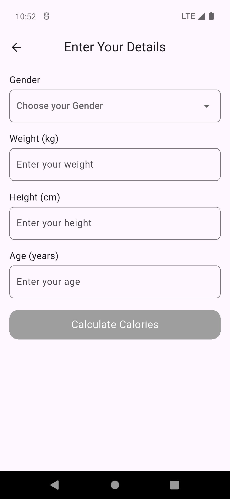
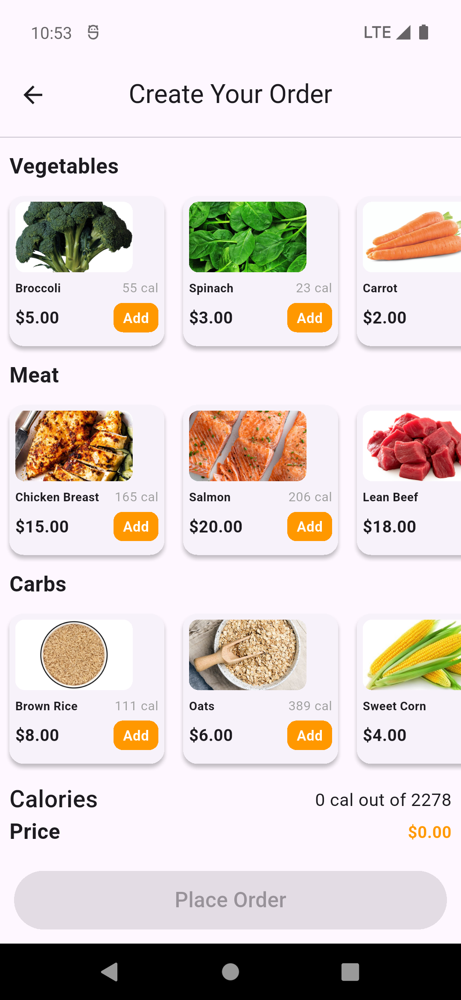
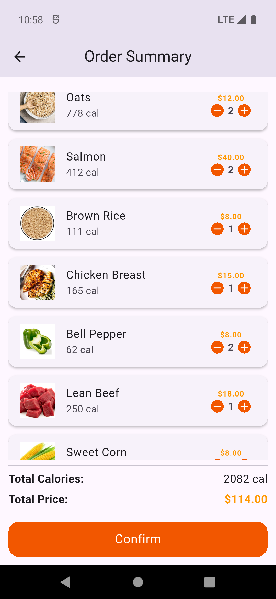

# 🥗 Task2 - Calories Order App

A simple Flutter application that calculates your daily calorie needs based on gender, weight, height, and age. It then allows you to build a food order while tracking total calories and price.

---

## ⚙️ Requirements

- Flutter 3.x.x
- Provider package
- HTTP package
- Internet connection for images and API request

---

## 🚀 Features

✅ User input screen to calculate calories  
✅ Gender selection with visual feedback  
✅ Order building screen with categorized food options  
✅ Real-time calorie and price calculation  
✅ Order summary screen before confirming the order  
✅ Place order via HTTP request  
✅ Clean, responsive UI  

---

## 📷 Screenshots

| User Input Screen               | Food Selection Screen            |
|---------------------------------|-----------------------------------|
|  |  |

| Order Summary Screen            | Order Placed Response            |
|---------------------------------|-----------------------------------|
|  |  |

---

## 🧩 Tech Stack

- Flutter & Dart
- Provider for state management
- HTTP package for API communication

---

## 📁 Folder Structure

lib/
├── model/ # Data models
│ └── user_model.dart # User details model
│
├── provider/ # State management (Provider)
│ └── user_provider.dart # Manages user-related state
│
├── views/ # Application screens
│ ├── user_input_screen.dart # Screen to input user details
│ ├── order_screen.dart # Food selection screen
│ └── summary_order.dart # Order summary & confirmation screen
│
├── widgets/ # Reusable UI components
│ └── button.dart # Custom orange button
│
└── main.dart # Entry point of the app

---

## 🔥 How It Works

1. User enters gender, weight, height, and age.
2. App calculates recommended calories using a simple formula.
3. User selects food items by category (Vegetables, Meats, Carbs).
4. App tracks total calories and price in real-time.
5. Once within calorie range, user proceeds to order summary.
6. Confirm order sends a POST request to the backend.

---

## 💡 Future Improvements

- Save user details locally
- Better calorie calculation formula (BMR)
- Add image placeholders for failed image loading
- Unit tests for validation logic
- Replace dummy API with a real backend

---

## 📦 Getting Started

1. Clone the project:
   ```bash
   git clone https://github.com/KhaledElKenawy00/order_food.git
   cd task2
